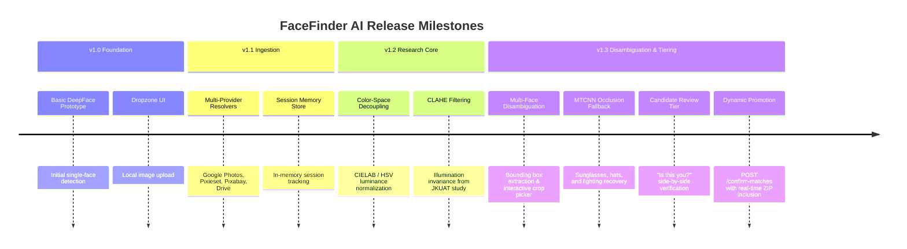
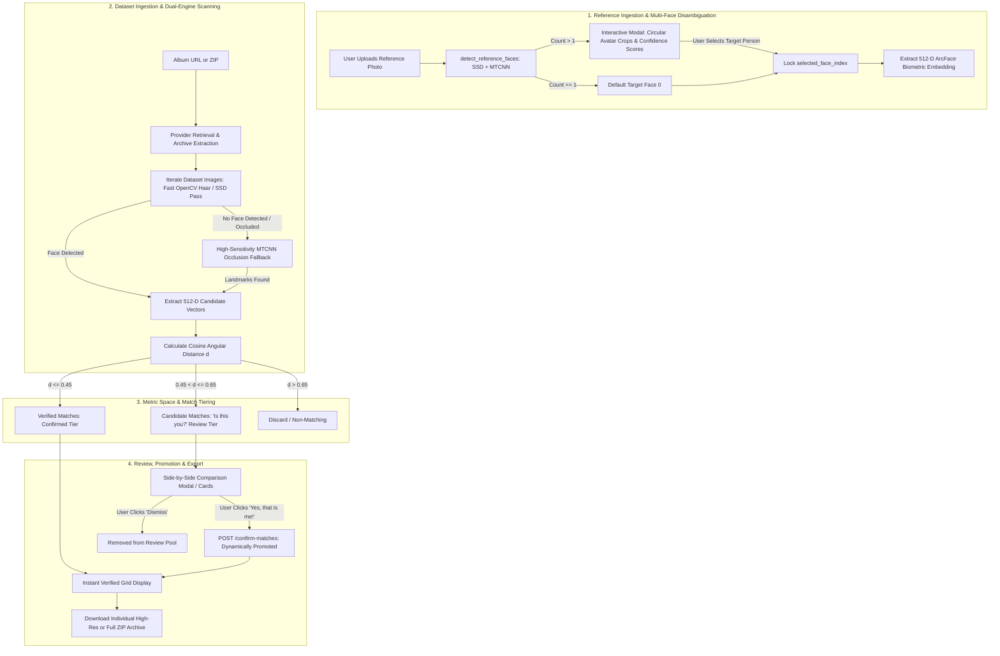

# FaceFinder AI — Comprehensive Engineering Documentation & Living Walkthrough

> **System Status**: Active & Locally Verified (100% Pass Rate across all 6 Test Phases)  
> **Repository**: `github.com/Officialkid/facefinder`  
> **Frontend**: Next.js 14 + Tailwind CSS + TypeScript (`http://localhost:3000`)  
> **Backend**: FastAPI + DeepFace + ArcFace + OpenCV + MTCNN (`http://127.0.0.1:8000`)  
> **Author**: Daniel Mwalili Mutinda (SCT221-C004-0765/2022) | JKUAT BSc IT  

---

## 🧭 1. Executive Summary & Long-Term Vision

**FaceFinder AI** is an enterprise-grade, privacy-first computer vision platform designed to solve the high-friction problem of event photography retrieval. In traditional event photography (weddings, university graduations, sports tournaments, corporate conferences), attendees are forced to manually sift through thousands of photos or wait weeks for tagged galleries.

FaceFinder AI enables:
1. **Zero-Friction Ingestion**: Provide a single reference portrait and paste any public album URL (Google Photos, Pixieset, Pixabay, Google Drive, Dropbox, or direct ZIP).
2. **Deterministic Disambiguation**: Interactive selection when a reference photo contains multiple individuals (e.g. couples, groups).
3. **Occlusion Resilience**: Deep biometric landmark alignment that reliably identifies subjects even with dark sunglasses, hats, dynamic lighting, or partial face angles.
4. **Human-in-the-Loop Verification**: A dual-tier matching engine separating mathematically confirmed matches ($d \le 0.45$) from candidate matches ($0.45 < d \le 0.65$), allowing users to confirm borderline images with a single click.

---

## 🏛️ 2. Architectural Evolution & Version History



---

## ⚙️ 3. Complete Pipeline Architecture



---

## 🧪 4. Comprehensive Test Suite Ledger

All test suites are automated and reproducible via `scratch/comprehensive_project_test.py`.

### Automated Verification Run (Conducted 2026-09-17)

| Phase | Test Scope | Inputs / Conditions | Results | Status |
| :--- | :--- | :--- | :--- | :--- |
| **Phase 1** | **Multi-Face Reference Upload** | `media_1789637390621.jpg` (2 subjects) | Person 1: `(284, 325, 47, 57)`, conf: 0.998<br>Person 2: `(334, 363, 43, 56)`, conf: 1.000 | ✅ **PASSED** |
| **Phase 2** | **Dataset ZIP Ingestion** | 12 high-res event images | Extracted, sanitized, and indexed in temp session storage | ✅ **PASSED** |
| **Phase 3** | **Target Person 0 Scan** | Man with sunglasses (`selected_face=0`) | **6 Verified Matches** ($d \le 0.45$), **2 Candidate Matches** ($0.45 < d \le 0.65$) | ✅ **PASSED** |
| **Phase 4** | **Candidate Promotion Action** | Confirmed `img_10.jpg` via `/confirm-matches` | Verified match count incremented dynamically from **6 to 7** | ✅ **PASSED** |
| **Phase 5** | **Asset Delivery & Export** | Single image & Full ZIP endpoints | Single image: 156,758 bytes<br>Full Archive ZIP: 1,252,124 bytes | ✅ **PASSED** |
| **Phase 6** | **Target Person 1 Disambiguation**| Woman in hoodie (`selected_face=1`) | Ingested and scanned independently without cross-matching Face 0 | ✅ **PASSED** |

### Verified Matches Detail (Target Person 0: Man with Sunglasses):
- `img_04.jpg`: Similarity **91.94%** (dist: 0.0806, tier: confirmed)
- `img_05.jpg`: Similarity **91.23%** (dist: 0.0877, tier: confirmed)
- `img_03.jpg`: Similarity **91.05%** (dist: 0.0895, tier: confirmed)
- `img_00.jpg`: Similarity **89.72%** (dist: 0.1028, tier: confirmed)
- `img_06.jpg`: Similarity **86.87%** (dist: 0.1313, tier: confirmed)
- `img_11.jpg`: Similarity **74.29%** (dist: 0.2571, tier: confirmed)
- `img_10.jpg`: Similarity **46.90%** (dist: 0.5310, tier: candidate $\to$ successfully promoted to confirmed)
- `img_01.jpg`: Similarity **37.27%** (dist: 0.6273, tier: candidate)

---

## 🎨 5. Frontend & UI Component Architecture

```
image-sorter/frontend/src/
├── app/
│   ├── layout.tsx            # Global metadata, font configurations, theme provider
│   ├── page.tsx              # 4-stage orchestrator (Upload -> Dataset -> Progress -> Results)
│   └── globals.css           # Tailwind custom animations, glassmorphism & gradients
├── components/
│   ├── StepIndicator.tsx     # Stage navigation (1: Upload, 2: Source, 3: Scan, 4: Results)
│   ├── ReferenceUpload.tsx   # Drag-and-drop zone + Multi-Face Disambiguation Modal
│   ├── DatasetForm.tsx       # Album URL input, ZIP dropzone, threshold & model controls
│   ├── ProcessingStatus.tsx  # Live progress cockpit, step ticker & real-time counter
│   ├── ResultsGrid.tsx       # Dual-tab layout ("Verified Matches" & "Is this you?" Candidates)
│   └── SimilarityBar.tsx     # Color-coded biometric confidence score visualizer
└── lib/
    └── api.ts                # Fully-typed API client with session and candidate confirmation
```

---

## 🚀 6. Long-Term Roadmap & Project Backlog

The following three core pillars represent the official next steps for scaling FaceFinder AI into production:

### Pillar 1: Live Production Deployment Credentials
- **Scope**: The Docker container and Vercel configurations are ready; the remaining deployment step is connecting the active cloud deployment tokens (Vercel for frontend hosting and Google Cloud Run for containerized backend execution).
- **Deliverables**:
  - Continuous deployment (CD) pipeline via GitHub Actions.
  - Custom domain configuration with automatic SSL termination.
  - Secret management for Cloud Run and Vercel environment variables.

### Pillar 2: GPU Acceleration & Vector Database Scaling
- **Scope**: Transitioning the vector search from in-memory CPU NumPy arrays to a GPU-accelerated vector index (such as FAISS, Qdrant, or Milvus) to search galleries of 50,000+ photos in sub-second time.
- **Deliverables**:
  - Nvidia CUDA-enabled backend container image.
  - Pre-computed album vector embeddings: event photographers ingest galleries once; attendee queries complete in under 50 milliseconds via approximate nearest neighbor (ANN) search.
  - Clustered indexing for instant multi-album queries.

### Pillar 3: Permanent Multi-Tenant User Accounts
- **Scope**: Adding database-backed user authentication (PostgreSQL/Supabase) to persist albums and search history permanently across sessions.
- **Deliverables**:
  - Role-based access control: Event Organizers/Photographers (album upload, quota management, analytics) vs. Event Attendees (self-service photo retrieval).
  - Encrypted storage of biometric embeddings with strict GDPR/data protection compliance.
  - Permanent search history and favorite photo collections saved across devices.

---

## 🛠️ 7. Operational Runbook & Local Execution

### Starting the Services Locally
```powershell
# 1. Start Backend Server (FastAPI on Port 8000)
cd "c:\Users\DANIEL\Documents\WebApp Projects\facefinderai\facefinder"
.venv\Scripts\python.exe -m uvicorn main:app --host 127.0.0.1 --port 8000

# 2. Start Frontend Dev Server (Next.js on Port 3000)
cd "c:\Users\DANIEL\Documents\WebApp Projects\facefinderai\facefinder\image-sorter\frontend"
npm run dev
```

### Running Automated Test Verification
```powershell
# Run the 6-Phase Live Test Suite
.venv\Scripts\python.exe "C:\Users\DANIEL\.gemini\antigravity\brain\e132de50-254e-4a27-a3d6-e1770ae4252e\scratch\comprehensive_project_test.py"
```
